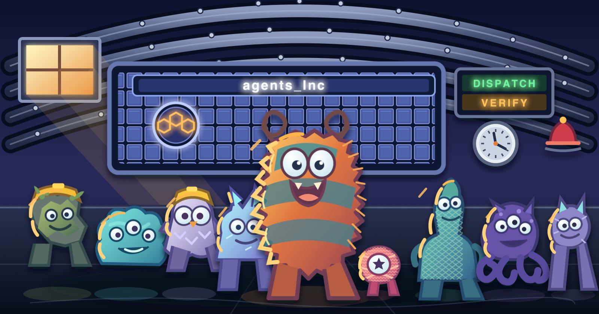
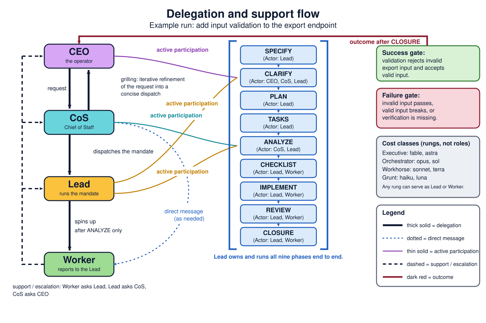

<p align="center"></p>

# agents_Inc

A corporate organization for AI agents: the CEO asks, the CoS dispatches a Lead, the Lead runs Workers. This WIP's goal is to get more juice out of your agentic-AI subscription.




[](https://github.com/domattioli/agents_Inc/actions/workflows/tests.yml)

[](https://github.com/domattioli/agents_Inc/issues)
[](https://github.com/domattioli/agents_Inc/issues)
[](https://doi.org/10.5281/zenodo.22670100)

**How to use:** `PYTHONPATH=. python3 tools/governance_demo.py --fake` runs governed routing, policy checks, and ledger recording with no provider keys. See [Getting started](#9-getting-started) for real-provider setup. To send real work, see the dispatch command in [section 2](#2-asking-for-work-in-plain-language).

1. [Why pool model capacity](#1-why-pool-model-capacity)
2. [Asking for work in plain language](#2-asking-for-work-in-plain-language)
3. [How the speckit pipeline and grilling are adapted here](#3-how-the-speckit-pipeline-and-grilling-are-adapted-here)
4. [How the governed pool works](#4-how-the-governed-pool-works)
5. [Project status](#5-project-status)
6. [Where it fits](#6-where-it-fits)
7. [Limitations](#7-limitations)
8. [Future work](#8-future-work)
9. [Getting started](#9-getting-started)
10. [Appendix: HTTP bridge](#10-appendix-http-bridge)

<div align="right"><a href="#agents_inc"><sub>^ Back to top</sub></a></div>

## 1. Why pool model capacity

Delegated model work can look done while being wrong. A flat pool of agents has no way to catch that.

`agents_Inc` borrows a [corporate org chart](docs/governance/DELEGATION-MODEL.md). Two roles are fixed: the CEO (you) and the CoS (the session you talk to). Every other role follows from the reporting chain: a Lead manages a run, and a Worker reports to a Lead. Authority and review sit where the gate puts them, not with whichever model answers first.

Each role sees only what its job needs. A contract goes down; an artifact trail comes back. Grilling aligns the CoS with the CEO on the request before the CoS dispatches the Lead. Speckit gates the request through spec, plan, tasks, and review. Bindle keeps the output of every run addressable.

Cheap models take routine work. Costlier models manage. An author never grades its own work: the Lead validates what its Workers report before anything moves up. [Savings are unmeasured, so none are claimed.](docs/PLAN-MVP.md) This is a structure for trust, not a number.

<div align="right"><a href="#agents_inc"><sub>^ Back to top</sub></a></div>

## 2. Asking for work in plain language

Name your models in plain English. The ladder decides who manages whom, and the rest fills in. You do not hand-pick every model or write JSON.

A **rung** is a cost and capability class: Executive, Orchestrator, Workhorse, Grunt. A rung is not a job title. The chain of command decides who is Lead and who is Worker.

### Worked example: name two, get four

The ladder has four rungs. Each rung is a Claude/Codex model pair ([docs/governance/ROUTING-RANKING.md](docs/governance/ROUTING-RANKING.md)). You usually name only the top two models:

**Rung ladder (name these two models; the rest derive):**

```
                    CAPABILITY (complex reasoning, judgment, tool coordination)
                                    ↑
                                    │
┌─────────────────────────────────────────────────────────────────┐
│                                                                  │
│  ★ EXECUTIVE                                                    │
│    ├─ Claude: Fable 5          ← Name this one                 │
│    └─ Codex: Astra             ← OR this one                   │
│    Role: Final say, irreversible acts, conflicting results      │
│                                                                  │
├─────────────────────────────────────────────────────────────────┤
│                                                                  │
│  ★ ORCHESTRATOR (Lead)                                         │
│    ├─ Claude: Opus 5           ← Name this one                 │
│    └─ Codex: Sol               ← OR this one                   │
│    Role: Decompose, dispatch, complex planning                 │
│                                                                  │
├─────────────────────────────────────────────────────────────────┤
│                                                                  │
│  WORKHORSE                                                       │
│    ├─ Claude: Sonnet 5         ← Derives automatically         │
│    └─ Codex: Terra                                             │
│    Role: Normal coding, research, synthesis                     │
│                                                                  │
├─────────────────────────────────────────────────────────────────┤
│                                                                  │
│  GRUNT                                                           │
│    ├─ Claude: Haiku 4.5        ← Derives automatically         │
│    └─ Codex: Luna                                              │
│    Role: Routine classification, extraction, summarization      │
│                                                                  │
│  (Optional: Gemini, Mistral, OpenRouter free tiers at Grunt)    │
│                                                                  │
└─────────────────────────────────────────────────────────────────┘
                                    │
                                    ↓
                    COST (cheapest → most expensive)
```

Write the kickoff as `<task>. <models>.` For example:

> "Fix the parser. opus, haiku."

That is enough. When you name two or more models, the higher rung manages and the lower rung reports to it. Here opus is the Lead and haiku is its Worker. At the same rung, the CoS asks you one question to name the Lead. Defaults fill the rest: effort medium, gates derived from the task, and the home repo from the consumer's `AGENTS.md`. Each extra word (effort, budget mode, review vendor) overrides exactly one default.

Delegation has limits:

- Executive and Orchestrator rungs delegate to any lower rung.
- Workhorse delegates only to Grunt, and only with a written allowlist.
- Grunt never delegates.
- Depth stops at 3 levels below the CoS.

The CoS answers lookups of 3 tool calls or fewer itself. Every repository edit goes through a delegate, including a one-line edit.

### Layering on constraints

A real dispatch prompt carries more than a model name. The **delegation prompt contract** is a binding list of 14 required elements, enforced by [skills/workerbee/SKILL.md](skills/workerbee/SKILL.md) Step 11. You do not type all 14. Five show up often enough to know by name:

- **Success gate and failure gate**, stated separately. The success gate is the objective that marks the task done. The failure gate is the hard stop that rejects the task. A delegate's own PASS claim is never the final word.
- **Effort level**: `low|medium|high|xhigh|max` (Claude) or the same plus `ultra` (Codex). Medium is the default.
- **Scope boilerplate**: repo-scoped writes only, no credential or cross-repo writes. Only the CoS commits and pushes.
- **CONSTRAINTS and OUT OF SCOPE**: two required lines that state what the delegate must not do and what it must leave alone.
- **Evidence tags**: every factual claim carries a tag, so a reader can tell what was verified.

A baseline snapshot guards the scope. Before dispatch, `skills/workerbee/scripts/pre_dispatch_snapshot.py` records a hash of every dirty and untracked file. After the run, it verifies that nothing outside the allowed paths changed.

Reports have a fixed shape. The narrative stays within 40 lines. A mandatory `OUT OF SCOPE / INCOMPLETE:` section is never capped. Fenced evidence does not count toward the cap.

You do not render, lint, snapshot, and launch by hand. One command does all four and then verifies the result:

```
agents-inc dispatch --slots <json> --model <slug>
```

See [AGENTS.md](AGENTS.md), [skills/workerbee/QUICKREF.md](skills/workerbee/QUICKREF.md), and [skills/workerbee/SKILL.md](skills/workerbee/SKILL.md) Step 11 for the current list.

For a big lift, the CoS keeps one short run spec in your home repo under `specs/consumers/<repo>/runs/`. A big lift is a run with 2 or more delegates, or a run that edits canon. The run spec records the ask, the resolved chain, the gates, the snapshot path, and the outcome. For this operator the home repo is DomI. Other consumers name theirs in `AGENTS.md`.

### Patterns and anti-patterns

**Pattern.** Grill first, name models second, dispatch third.

1. The CoS grills you until the request is sharp, one question at a time, with a recommended answer. See [docs/governance/DELEGATION-MODEL.md](docs/governance/DELEGATION-MODEL.md) for the grilling step in the org chart.
2. Once "this refactor" has a real scope, you name the models: "Refactor the export module. opus, sonnet."
3. The CoS dispatches only the Lead (opus) with the full mandate and the roster. The Lead decomposes the work, runs its Workers, and reports up once, when the mandate ends.

Each step depends on the one before it. Skipping ahead breaks the chain.

**Anti-pattern.** Naming models and dispatching on a vague request, with no grilling step. Someone says "fix the export bug" and the session starts dispatching at once. Nobody has defined what "fix" means, which endpoint is involved, or what counts as done. The success gate and failure gate then rest on an unsharpened request, so they come out vague or wrong. A delegate can pass its own gate and still miss the intent. This is the failure class that Section 1 describes: delegated work that looks done while being wrong.

<div align="right"><a href="#agents_inc"><sub>^ Back to top</sub></a></div>

## 3. How the speckit pipeline and grilling are adapted here

This repo's speckit binding runs an autonomous phase chain. [skills/speckit-pipeline/scripts/resolve_rung.py](skills/speckit-pipeline/scripts/resolve_rung.py) resolves each phase's rung name live against [docs/governance/ROUTING-RANKING.md](docs/governance/ROUTING-RANKING.md) and fails closed on an unknown rung. [skills/speckit-pipeline/scripts/ledger_bridge.py](skills/speckit-pipeline/scripts/ledger_bridge.py) passively records every dispatch and return in an append-only ledger. Phases still run through the `Agent` tool.

The Lead decides gates, accepts or rejects results, resolves conflicts, and handles irreversible acts. A Worker executes coding, research, and synthesis per gate, reports evidence, and never accepts its own work. This keeps acceptance independent of the Worker's confidence. Rung names stay cost classes; the chain sets the role.

Automation can prepare, route, record, verify, and close routine work. Phases marked unattended may run without a live operator. Lead gates stay required for authority, ambiguity, risk, and acceptance.

The diagram at the [top of this README](#agents_inc) shows the CEO, CoS, Lead, and Worker roles across the nine speckit phases. A machine-readable version (Mermaid and a phase-actor table) is in [docs/governance/DELEGATION-MODEL.md](docs/governance/DELEGATION-MODEL.md).

**Grilling.** A grill is an attended session: the CoS asks one question at a time and gives a recommended answer first. Its output updates `CONTEXT.md` and records a ruling in [docs/DECISIONS.md](docs/DECISIONS.md), or becomes delegation context for the next action. It is not a packaged execution step.

**Speckit pipeline phases (five-stage flow with ledger records):**

```
Phase 1: SPECIFICATION
├─ Task: Author requirements and resolve ambiguity
├─ Output: Spec document + verified success/failure gates
├─ Ledger: Record task + resolved rung
├─ Mode: Unattended only after Lead scope gate
└─ Next: Phase 2

      ↓

Phase 2: PLAN
├─ Task: Decompose into subtasks, assign rungs, set risk gates
├─ Output: Step-by-step plan + dispatch matrix
├─ Ledger: Record plan, rung, and authority for each subtask
├─ Mode: Unattended when scope and risk gates are set
└─ Next: Phase 3

      ↓

Phase 3: IMPLEMENTATION
├─ Task: Execute through the Agent tool
├─ Output: Completed subtasks, worker returns, decision nodes
├─ Ledger: Record dispatch, return, and worker metadata
├─ Mode: Worker executes; Lead decides exceptions
└─ Next: Phase 4

      ↓

Phase 4: REVIEW
├─ Task: Cross-vendor verifier + reviewer gates (see Section 4)
├─ Output: Acceptance decision + rationale
├─ Ledger: Record verification and reviewer consensus
├─ Mode: Unattended checks allowed; Lead owns acceptance
└─ Next: Phase 5

      ↓

Phase 5: CLOSURE
├─ Task: Integrate verified outputs, mark task done
├─ Output: Final deliverable + close ledger run
├─ Ledger: Record closure + link to PR/commit
├─ Mode: Unattended after acceptance gate
└─ End: Task complete
```

<div align="right"><a href="#agents_inc"><sub>^ Back to top</sub></a></div>

## 4. How the governed pool works

**Routing** (selecting the vendor and rung for each task by cost, capability, and policy) uses four rungs: Grunt, Workhorse, Orchestrator, and Executive. The rung names are cost classes. They do not name roles. Each rung names one Claude model and one Codex model. Gemini, Mistral, and OpenRouter can enter only at Grunt, and only for `extract` and `summarize` tasks. [workerbees/router.py](workerbees/router.py) enforces that boundary and selects the vendor and model for each dispatch ([workerbees/routing.json](workerbees/routing.json), [workerbees/router.py](workerbees/router.py)).

**Policy** (the rules that decide which models may take which task classes) is encoded in [workerbees/routing.json](workerbees/routing.json). The router checks it before dispatch.

Roles come from the reporting chain, not from the rung:

- The CEO is the operator. The CoS is the session the operator talks to.
- The Lead is the top-ranked model the operator names for a run. The Lead manages the run and reports to the CoS once, at the end.
- A Worker is any agent that reports to a Lead.

Delegation limits follow the rung; see [section 2](#2-asking-for-work-in-plain-language).

Moving to a costlier rung requires a recorded reason: repeated failed checks or a provider quota pause. Worker confidence is not an escalation reason.

Four separations hold by gate, not by title:

- An author never grades their own work.
- The reviewer is a different vendor for canon edits and irreversible acts. For routine code, the same vendor is allowed.
- Only the CoS commits and pushes.
- A Worker sees only its own slice of the work.

Verification runs in this order:

1. **Verifier** (deterministic code checks, no model call): [workerbees/verifier.py](workerbees/verifier.py) checks cited claims against source text without calling a model, for example quote accuracy, file existence, and hash match.
2. **Reviewer** (cross-vendor semantic review, a model-based check): [workerbees/reviewer.py](workerbees/reviewer.py) reviews the meaning of the output with a provider from a different vendor than the Worker, when possible. It returns `same_vendor` without a model call when reviewer and Worker providers match. That result means a person must review the output.
3. **Ledger** (append-only audit trail of every decision): [workerbees/ledger.py](workerbees/ledger.py) records dispatches, returns, reviews, and acceptance decisions. It writes to JSONL and SQLite by default, so the trail is auditable and queryable.

A Worker's own PASS or FAIL is never the final verdict. Acceptance follows verifier and reviewer results recorded in the ledger ([workerbees/pipeline.py](workerbees/pipeline.py)).

**Verification pipeline flow (with timing and decision gates):**

```
Worker Task
│
└──→ [WORKER] (via dispatch gateway or Agent tool)
     ├─ Output: candidate response
     ├─ Latency: depends on model + task
     ├─ Cost: 1 × worker rung model cost
     └─ Metadata: logged to ledger as node

           ↓ (immediate)

     [VERIFIER] (deterministic, no model call)
     ├─ Task: Check cited claims against source text
     │        (file existence, quote accuracy, hash match, arithmetic)
     ├─ Latency: ~100–500ms (sync, same-process)
     ├─ Cost: $0 (code only)
     ├─ Result: PASS or FAIL
     └─ Metadata: logged to ledger as verification node
     
     ├─ FAIL path: Stop. Record failure. Return to human.
     └─ PASS path: Continue to reviewer

           ↓ (async, parallel with other tasks possible)

     [REVIEWER] (cross-vendor model call)
     ├─ Task: Semantic review using different provider
     │        (Does output answer the question? Is reasoning sound?
     │        Do claims align with verifier's fact-check?)
     ├─ Latency: ~2–20 seconds (model inference, typically async)
     ├─ Cost: 1 × reviewer rung model cost
     │         (may differ from worker rung; routed by reviewer.py)
     ├─ Result: PASS, FAIL, or SAME_VENDOR
     │          (SAME_VENDOR = no call made; return to human)
     └─ Metadata: logged to ledger as review node
     
     ├─ FAIL path: Stop. Record failure + reviewer rationale. Return to human.
     ├─ SAME_VENDOR path: Stop. Flag for manual review (cache hit).
     └─ PASS path: Continue to ledger + acceptance

           ↓ (immediate)

     [LEDGER] (append-only dual-write: JSONL + SQLite)
     ├─ Task: Record all dispatch metadata, worker output, verifications,
     │        review result, and acceptance decision
     ├─ Dual-write:
     │    ├─ JSONL: ~/.workerbees/ledger.jsonl (human-readable, append-only)
     │    └─ SQLite: ~/.workerbees/ledger.db (queryable, indexed)
     ├─ Cost: $0 (disk I/O only)
     ├─ Latency: ~10–50ms per node
     └─ Output: Run summary + decision record

           ↓

     [DECISION] → ACCEPTED (pass all gates) or NEEDS_REVIEW (human override)

Example: 500-word summary task
├─ Worker (Haiku): 2 sec + $0.01
├─ Verifier: 0.2 sec + $0
├─ Reviewer (Terra): 8 sec + $0.04
├─ Ledger: 0.05 sec + $0
├─ Total: ~10 sec + $0.05
└─ Decision: PASS (if verifier + reviewer agree)
```

Today's schema still requires a Claude model name and a Codex model name at every tier. Making either subscription optional is a goal of the pooling design, not current behavior ([workerbees/config_schema.py](workerbees/config_schema.py), [workerbees/keys.py](workerbees/keys.py)).

<div align="right"><a href="#agents_inc"><sub>^ Back to top</sub></a></div>

## 5. Project status

**Pre-MVP and under active development.** The build plan and cut line live in [docs/PLAN-MVP.md](docs/PLAN-MVP.md).

Built and tested today:

- The four-rung router and optional-provider restrictions.
- Deterministic citation verification and enforced cross-vendor semantic review.
- An append-only JSONL and SQLite ledger.
- A local SHA-256 content-addressed artifact store.
- The governed dispatch gateway, including envelope, policy, registry, and budget checks.
- The live [agent.sh](skills/codex-bridge/scripts/agent.sh)/[agent_runner.py](skills/codex-bridge/scripts/agent_runner.py) dispatch path (shells out to the Codex CLI directly; [bridge.py](bridge.py) is a separate HTTP path for a second device, see appendix).
- 1038 automated tests passing locally (13 skipped live probes) with `python3 -m unittest discover -s tests -p 'test_*.py'`, plus 28 workerbee skill tests under `skills/workerbee/tests`.

New dispatch tooling:

- A snapshot gate: [pre_dispatch_snapshot.py](skills/workerbee/scripts/pre_dispatch_snapshot.py) hashes every dirty and untracked file before dispatch and checks them afterward (D45).
- Free-model rate-limit counts: `PYTHONPATH=. python3 -m agents_inc.free_health rate-limits` lists calls and 429 responses for each model. Counts start on 2026-09-29 ([docs/BENCH.md](docs/BENCH.md)).
- A dispatch command: `agents-inc dispatch` renders, lints, snapshots, launches, and verifies one dispatch.

`WORKERBEES_GOVERNANCE` still defaults to `off`. The governed path therefore exists but is not enabled by default ([workerbees/gateway.py](workerbees/gateway.py)).

The [gask.sh](skills/codex-bridge/scripts/gask.sh), [mask.sh](skills/codex-bridge/scripts/mask.sh), and [oask.sh](skills/codex-bridge/scripts/oask.sh) scripts are the free-tier legacy path. They still work when governance is off, are refused in governed lanes, and are planned to be folded into the governed dispatcher. Each call reports its outcome to `agents_inc.free_health`. `oask.sh` saves every reply to one file, so never run OpenRouter calls in parallel.

Bindle Backend A is built: the local content-addressed artifact store captures and retrieves run output, and `WORKERBEES_ARTIFACTS` defaults to `local`. Backend B remains deferred. It requires an idempotent `finish_run` terminal event and a validated invoice mapping before any real `deislabs/bindle` installation or publication path.

<div align="right"><a href="#agents_inc"><sub>^ Back to top</sub></a></div>

## 6. Where it fits

`agents_Inc` is an integration and governance layer above provider tools. It does not replace their CLIs or instruction formats.

| Provider tool | Used here | Changed | Notes |
|---|---|---|---|
| Claude Skills (SKILL.md format) | Yes | No, standard frontmatter | Packages routing and verification judgment as reusable prose (`skills/workerbee`, `skills/codex-bridge`) |
| Claude subagents / Agent tool | No | — | Single-vendor; cannot enforce cross-vendor review by itself |
| Claude Code hooks | Yes | Added | The installer wires SessionStart, PreToolUse and PostToolUse on Agent spawns, and UserPromptSubmit for `@alias` questions ([host_wiring.py](agents_inc/install/host_wiring.py), [AT-ROUTE.md](docs/at-route/AT-ROUTE.md)) |
| Model Context Protocol (MCP) | Only for the D51 Lead transport | Built | [mcp_broker.py](agents_inc/install/mcp_broker.py) is a stdio MCP server that fronts the dispatch broker for a Codex Lead; all other dispatch uses an HTTP bridge and CLI wrapper |
| OpenAI Codex CLI | Yes | Wrapped | [bridge.py](bridge.py) adds a persistent-thread HTTP session; [agent.sh](skills/codex-bridge/scripts/agent.sh) and [agent_runner.py](skills/codex-bridge/scripts/agent_runner.py) add a governed asynchronous job queue bound to the ledger |
| OpenAI Assistants / Agent SDK | No | — | Uses the Codex CLI and this repository's dispatcher |
| Built here, no vendor equivalent | — | — | [ledger.py](workerbees/ledger.py) (audit trail), [reviewer.py](workerbees/reviewer.py) (cross-vendor enforcement), [verifier.py](workerbees/verifier.py) (deterministic pre-check), [artifacts.py](workerbees/artifacts.py) (content-addressed store), [router.py](workerbees/router.py)/[routing.json](workerbees/routing.json) (tier and vendor routing) |

This repository is for developers who use more than one model provider, want to control incremental spend, and need delegated work checked independently before acceptance.

### Compared with other tools

✅ means built in. ❌ means not built in; you may still add it with your own code.

| Tool | Several vendors | No API billing ² | Routes by rule | Other-vendor review ³ | Scripted checks ³ | Decision ledger | `@model` question | Parallel worktrees | Workflow SDK |
|---|---|---|---|---|---|---|---|---|---|
| **agents_Inc** | ✅ | ✅ | ✅ | ✅ | ✅ | ✅ | ✅ | ❌ | ❌ |
| [CrewAI](https://docs.crewai.com) | ✅ | ❌ | ❌ | ❌ | ✅ | ❌ | ❌ | ❌ | ✅ |
| [AutoGen](https://github.com/microsoft/autogen) / Microsoft Agent Framework ⁴ | ✅ | ❌ | ❌ | ❌ | ❌ | ❌ | ❌ | ❌ | ✅ |
| [firstmate](https://github.com/kunchenguid/firstmate) ⁵ | ✅ | ✅ | ❌ | ❌ | ❌ | ❌ | ❌ | ✅ | ❌ |
| [aider](https://aider.chat) | ✅ | ❌ | ❌ | ❌ | ✅ | ❌ | ❌ | ❌ | ❌ |
| Claude model-router hooks ¹ | ❌ | ✅ | ✅ | ❌ | ❌ | ❌ | ❌ | ❌ | ❌ |
| Claude Code `/advisor` | ❌ | ✅ | ❌ | ❌ | ❌ | ❌ | ❌ | ❌ | ❌ |
| RouteLLM, Martian, Not Diamond | ✅ | ❌ | ✅ | ❌ | ❌ | ❌ | ❌ | ❌ | ❌ |

What the columns mean:

- **Several vendors**: one setup can use models from more than one company.
- **No API billing**: runs on the CLI subscriptions you already pay for, so extra work costs $0.
- **Routes by rule**: picks the model for each task from a written policy, not by hand.
- **Other-vendor review**: a model from a different company must approve the work before it counts.
- **Scripted checks**: tests, lint, or other commands must pass before the work counts.
- **Decision ledger**: an append-only record of who did what and who approved it.
- **`@model` question**: inside Claude Code, ask one named model one question without the session model answering.
- **Parallel worktrees**: runs many agents at once, each in its own git worktree.
- **Workflow SDK**: a Python library for writing multi-agent programs.

Notes:

1. [claude-model-router-hook](https://github.com/tzachbon/claude-model-router-hook), [auto-model-router](https://github.com/IuriiTurok/auto-model-router), [model-routing](https://github.com/abroberts14/model-routing), and [claude-router](https://github.com/bmersereau/claude-router). They choose between Claude models per session, task, or subagent. Details: [AT-ROUTE-PRIOR-ART.md](docs/at-route/AT-ROUTE-PRIOR-ART.md).
2. CrewAI, AutoGen, aider, and the API routers call provider APIs with your keys. They can also run free local models.
3. In `agents_Inc` these run on the governed path, which is off by default (`WORKERBEES_GOVERNANCE`).
4. AutoGen is in maintenance mode. Microsoft names Microsoft Agent Framework as its successor.
5. firstmate works at a different layer: where agents run and how they are watched. An evaluation is open in [#31](https://github.com/domattioli/agents_Inc/issues/31).
6. [Bindle](https://github.com/deislabs/bindle) is a sibling, not a rival. The ledger owns job identity and status; Bindle stores the artifact bytes.
7. Continue.dev also uses `@`, but its `@` adds a context source, not a model.

LangGraph and other agent frameworks are not in the table yet.

<div align="right"><a href="#agents_inc"><sub>^ Back to top</sub></a></div>

## 7. Limitations

The project has not yet measured cost savings or accuracy against its baseline. Local passing tests show that the implementation behaves as coded. They do not show that it is reliable in production. `WORKERBEES_GOVERNANCE` remains off by default, so a fresh checkout does not run the enforced-review path this repository is built around.

Cross-vendor review catches disagreement between models. It does not catch a blind spot that both vendors share. Deterministic verification checks what a check can express (citations exist, a file changed, a command exit code). It does not replace a human judgment call on scope or design quality.

Bindle Backend B (remote artifact publication) is unimplemented, so artifacts stay local-only today.

Open limits on the free pool:

- Free-model capacity varies. The 2026-09-29 probe in [docs/BENCH.md](docs/BENCH.md) found 429 or capacity errors on several free models.
- Ollama usage is logged to `~/.codex-bridge/usage.jsonl`, but `free_health` does not track Ollama yet.
- Delegates always receive the full prompt inline. D47 retired the reference-mode pilot of D45, because `agents-inc dispatch` keeps the CoS context flat without it.

<div align="right"><a href="#agents_inc"><sub>^ Back to top</sub></a></div>

## 8. Future work

Tracked as open issues on this repo:

- [#7](https://github.com/domattioli/agents_Inc/issues/7): a CLI-agnostic dispatch mechanism, the inverse of `codex-bridge`, so Codex can drive the same workflow and call Claude models.
- [#8](https://github.com/domattioli/agents_Inc/issues/8): `astra` dispatch with `--approve-for-me` can hit host-classifier blocks that `terra`/`luna` do not.
- [#6](https://github.com/domattioli/agents_Inc/issues/6): `codex-bridge`'s [up.sh](skills/codex-bridge/scripts/up.sh) hardcodes a stale pre-rename `BASE` path; `--workdir` doesn't override it.
- [#4](https://github.com/domattioli/agents_Inc/issues/4): a dispatch-prompt style-compression template, with findings and a validation plan.
- [#3](https://github.com/domattioli/agents_Inc/issues/3): brainstorm: mandate the speckit workflow for Lead-run work.

<div align="right"><a href="#agents_inc"><sub>^ Back to top</sub></a></div>

## 9. Getting started

### Install and configure providers

Run the project from the repository root. Its Python code uses the standard library. No Python package-install step exists.

**Skill dependencies.** The runtime dependencies of this repo are Claude Skills, not pip packages. [`skills.requirements.txt`](skills.requirements.txt) is the agentic-AI analog of `requirements.txt`. It pins the version and source of each skill. A source is either vendored in this repo or an external repo that the skill was copied from. Refresh and verify with:

```bash
bash scripts/install_skills.sh            # sync external-repo entries, verify vendored ones present
bash scripts/install_skills.sh --dry-run  # show what would change without touching anything
```

**Claude Code is required; Codex is optional (ruled 2026-10-03; both-optional is deferred to v1.0).** The Codex CLI is used when present, for Codex rungs and cross-vendor review. `agents-inc install` no longer aborts when the `codex` CLI is missing. Skills still install, and the receipt records no Codex path. The installer prints one `NOTE:` line for each skipped provider. Pass `--without-codex` (install and repair) to skip Codex on purpose and silence that note.

The installer also creates an empty `~/.config/agents-inc/roster.json` that you can edit. To override the built-in `luna`/`terra`/`sol`/`astra` slugs, put model aliases in that file or in `AGENTS_INC_MODEL_MAP` (a JSON object or a file path).

**Model pins and drift (D52).** Each Codex alias is pinned to one versioned slug in `agents_inc/routing.json`. The runtime and the `@alias` router both read the pin from that file. A pin never moves on its own. `agents-inc models` prints one line per alias with the pin, the newest slug of the same family, and `DRIFT` or `ok`. It reads the local Codex catalog at `$CODEX_HOME/models_cache.json` or `~/.codex/models_cache.json` and never the network. Only listed, API-supported slugs count, and the highest version wins. `agents-inc models bump <alias> [slug]` moves one pin to the newest slug, or to the slug you name. It rewrites `routing.json` and adds a `models.json` entry whose effort list comes from the catalog. It refuses with exit 2 when the slug is not in the catalog or is already pinned. It prints the two files it changed and never runs git, so you review and commit the bump yourself.

`agents-inc doctor` prints its status on the first line and one `WARNING:` line for each warning after it. Warnings never change the status, so `READY` still prints. `MODEL_DRIFT <alias>: pinned <slug>, newest <slug>` means the catalog lists a newer slug than the pin. `INSTALL_STALE` means the installed release differs from the checkout it was installed from; run `agents-inc repair --source <checkout>` to update it.

**DelegateAgent MCP server.** `skills/codex-bridge/mcp/codex_agent_mcp.py` exposes a `DelegateAgent` tool. The tool forwards a prompt to Codex. The model list comes from the same configurable map. By default only `luna` is exposed. Add `astra`, `sol`, or `terra` (after you test them live) through `~/.config/agents-inc/roster.json`, `AGENTS_INC_MODEL_MAP`, or `CODEXAGENT_MODEL_MAP`.

Registering the server with Claude is a separate, explicit step. The default run only prints the command: `bash skills/codex-bridge/mcp/install.sh` (add `--apply` to execute it). Check the server without Codex with `bash skills/codex-bridge/mcp/tests/smoke_mcp.sh --offline`.

**Setup decision tree. Follow the path that matches your setup:**

```
Do you have Claude Code CLI installed + authenticated?
├─ NO → Install via https://claude.ai/code (Anthropic account required)
│       └─ After install, continue below at "Do you have Codex..."
├─ YES → Do you have Codex CLI installed + authenticated?
│        ├─ NO → Install via https://openai.com/codex (OpenAI account required)
│        │       └─ After install, continue below at "Ready for..."
│        └─ YES → Do you want to use free-tier providers (Gemini, Mistral, OpenRouter)?
│                 ├─ NO → ✓ Ready for demo (no keys needed; optional providers skipped)
│                 │       └─ Run: PYTHONPATH=. python3 tools/governance_demo.py --fake
│                 └─ YES → Configure free tiers (optional; can skip each one)
│                         ├─ Run: python3 -m workerbees.keys gemini
│                         ├─ Run: python3 -m workerbees.keys mistral
│                         └─ Run: python3 -m workerbees.keys openrouter
│                           (Each opens provider page; press Enter to skip)
│                           ✓ Ready for real jobs (with optional-provider support)
│                           └─ Run: skills/codex-bridge/scripts/agent.sh submit --backend codex --wait "your prompt"
```

**Pick one path.** Test with `--fake` (no provider keys needed), or configure optional providers for production use.

**Key storage.** Each optional-provider command opens the key page of the provider and asks for a hidden paste. Press Enter to skip that provider. Stored keys go to `~/.config/workerbees/.env` with mode `0600`. The agent never receives the raw key.

**Important.** Never place a key in a command argument or model prompt. A skipped optional key is not an error. It removes that provider from the available pool. Current routing sends work to optional providers only for Grunt-class `extract` and `summarize` tasks.

> **If you skip a step, return to this tree to verify your path.**

### Quick start

1. Exercise governed routing, policy checks, and ledger recording without provider keys:

```bash
PYTHONPATH=. python3 tools/governance_demo.py --fake
```

The demo runs a fake worker and prints the resulting decision records.

2. After you configure the provider CLIs, submit a real Codex job:

```bash
skills/codex-bridge/scripts/agent.sh submit --backend codex --wait "your prompt"
```

3. Ask a cheaper model a side question from inside any Claude Code session. You do not switch sessions. The session model never runs, so the question costs about 1% of asking it directly:

```text
@haiku does the caveman plugin auto-update
```

The hook answers before the session model runs, so the session model spends zero tokens. Use `! @haiku ...` to put the answer in context. That form costs one session-model turn. Token comparison of every form: [docs/at-route/AT-ROUTE.md](docs/at-route/AT-ROUTE.md#which-form-saves-the-most-session-model-tokens). Aliases, savings table, and install: [docs/at-route/AT-ROUTE.md](docs/at-route/AT-ROUTE.md).

4. Run one governed dispatch from a slots file with `agents-inc dispatch` (D47). The command does five jobs. It renders the prompt and lints it. It snapshots the tree and launches the delegate. It then verifies the report and the snapshot, and prints one status line:

```bash
PYTHONPATH=. python3 -m agents_inc.install.cli dispatch --slots slots.json --model sonnet --dry-run
```

The CoS writes the slots file; [skills/workerbee/slots.md](skills/workerbee/slots.md) holds one worked example. Claude models launch through `claude -p`. Codex models launch through the existing Codex runner. Free providers stay on `agent.sh`. No API-key path exists. All other output, including the run record (`run.json`), stays in the run directory. Other flags: `--effort`, `--cwd`, `--tier grunt`, `--run-dir`, `--resume`, `--message`.

Under `agents-inc run`, astra, sol, and terra get a sandboxed Codex shell that cannot read your home directory, write outside the repository (unless `--write`), or reach the network; luna and the free providers never get one, and `--no-tools` turns it off for any run. A Codex Lead can request Workers without holding provider credentials: the CoS creates a run directory and runs `agents-inc dispatch --serve <run-dir>`; the Lead drops JSON requests into its `inbox/`, waits with `agents-inc dispatch --wait`, and reads back each Worker's result and report (D51). A Codex Lead reaches the dispatch broker through an MCP server started by `agents-inc run --lead <run-dir>`, with no write access to the run directory and an isolated CODEX_HOME; the file inbox remains as the fallback.

### How it feels to use

**Current workflow (today)**

| Step | User action | System output |
|---|---|---|
| 1. Submit | Run `skills/codex-bridge/scripts/agent.sh submit --backend codex --wait "your prompt"` | Raw model output (no review) |
| 2. Evaluate | Manually inspect output or invoke reviewer path | Accept, reject, or request revision |
| 3. Ledger | (Optional) Record decision if using reviewer | Decision added to ledger |

`agents-inc dispatch` (D47) already covers part of this flow. It renders, lints, snapshots, launches, and verifies one delegation in a single command, so steps 1 and 2 need no hand work for scope and report checks. Cross-vendor review and ledger recording stay separate steps.

**Pain points:** manual evaluation for every task, high cognitive load on the user, no automatic cross-vendor validation, and a login for both Claude and Codex even for Codex-only work.

**Planned workflow (beta goal, not yet built)**

| Step | User action | System output |
|---|---|---|
| 1. Submit | `agent.sh submit "your prompt"` | Task queued for execution |
| 2. Optimize | (automatic) Select cheapest eligible provider | Selection logged |
| 3. Execute | (automatic) Run worker at chosen rung | Worker output + metadata |
| 4. Verify | (automatic) Deterministic verifier + cross-vendor reviewer | Verification results |
| 5. Accept | (automatic if gates pass, manual otherwise) Review ledger entry | Verified result + ledger entry |

**Gains:** one-liner submit, automatic provider selection by cost, independent cross-vendor review before acceptance, a ledger entry for every decision, and credential reuse (only the needed provider).

**Status:** ⚠️ **Not yet built.** The verification and reviewer paths exist and are tested in isolation ([docs/PLAN-MVP.md](docs/PLAN-MVP.md)). End-to-end automation is a beta milestone, tracked in [docs/PLAN-MVP.md](docs/PLAN-MVP.md) as a phase 2 goal.

### Requirements

- Python 3.10 or later. The test suite also runs on Python 3.14.
- Bash 3.2 or later. The lifecycle and client scripts support macOS system Bash.
- Claude Code CLI, authenticated through an Anthropic subscription.
- Optional: Codex CLI, authenticated through a ChatGPT/OpenAI account. Used when present for Codex rungs and cross-vendor review.
- Optional: Gemini, Mistral, or OpenRouter API credentials. A missing optional key skips that provider. It does not block the system.

No LICENSE file exists yet.

### Documentation map

| File | Reader |
|---|---|
| [docs/START-HERE.md](docs/START-HERE.md) | New to the system, plain language |
| [docs/HOW-IT-WORKS.md](docs/HOW-IT-WORKS.md) | Operator or agent, dense reference |
| [docs/EXTENDING.md](docs/EXTENDING.md) | Adding a vendor, model, task class, or domain |
| [docs/PLAN-MVP.md](docs/PLAN-MVP.md) | Build plan, cut line, architecture, and phases |
| [docs/DECISIONS.md](docs/DECISIONS.md) | Binding rulings, rationale, and evidence |
| [CONTEXT.md](CONTEXT.md) | Glossary: CEO, CoS, Lead, Worker, Mandate, Home repo, and other fixed terms |
| [skills/workerbee/QUICKREF.md](skills/workerbee/QUICKREF.md) | Short form of the dispatch discipline: gates, ladder, 14-element prompt contract |
| [skills/workerbee/slots.md](skills/workerbee/slots.md) | Slots for `agents-inc dispatch`, with one worked example |
| [skills/workerbee/SKILL.md](skills/workerbee/SKILL.md) | Full supervision discipline |
| [docs/at-route/AT-ROUTE.md](docs/at-route/AT-ROUTE.md) | `@alias` side questions to a cheaper model from inside a session, with measured savings |

<div align="right"><a href="#agents_inc"><sub>^ Back to top</sub></a></div>

## 10. Appendix: HTTP bridge

[bridge.py](bridge.py) exposes the local `codex` CLI over authenticated HTTP for a second device. It is peripheral to the MVP. It uses one serialized Codex thread across requests.

<details>
<summary>Bridge API reference</summary>

### Run

```bash
export CODEX_BRIDGE_TOKEN=$(openssl rand -hex 32)
python3 bridge.py --port 8787
```

`--workdir DIR` sets the Codex working directory. The default is the current directory. The directory need not be a Git repository, because the bridge passes `--skip-git-repo-check`. The default bind address is `127.0.0.1`. The default execution timeout is 60 seconds. The default Codex sandbox is `workspace-write`.

### Persistent sessions

The bridge keeps one Codex thread across requests. Each prompt reuses the current `thread_id`. To start a new thread, send `"reset": true` with a prompt or call `POST /reset`.

### Endpoints

`GET /health` requires no authentication.

```bash
curl http://127.0.0.1:8787/health
# {"status":"ok"}
```

`GET /session` returns the current thread and sandbox. A null `thread_id` means the next prompt starts a new thread.

```bash
curl \
  -H "X-Auth-Token: $CODEX_BRIDGE_TOKEN" \
  http://127.0.0.1:8787/session
```

`POST /reset` clears the current thread.

```bash
curl -X POST \
  -H "X-Auth-Token: $CODEX_BRIDGE_TOKEN" \
  http://127.0.0.1:8787/reset
```

`POST /prompt` runs a prompt through the Codex CLI in non-interactive mode.

```bash
curl -X POST http://127.0.0.1:8787/prompt \
  -H "X-Auth-Token: $CODEX_BRIDGE_TOKEN" \
  -H "Content-Type: application/json" \
  -d '{"prompt":"explain currying in Haskell","model":"gpt-5-codex"}'
```

The request body accepts `prompt` (required string), `model` (optional), and `reset` (optional boolean). A successful response contains `response`, `thread_id`, `usage`, and, where applicable, session-restart metadata.

### Status codes

| Status | Meaning |
|---|---|
| 200 | Success |
| 400 | Invalid request body or fields |
| 401 | Missing or incorrect `X-Auth-Token` |
| 404 | Unknown endpoint |
| 413 | Request body exceeds 1 MiB |
| 429 | Codex reported a rate or quota limit |
| 500 | Codex CLI unavailable or an unhandled bridge error |
| 502 | Codex exited unsuccessfully; a failed session resume is retried once as a fresh thread unless rate-limited |
| 504 | Codex exceeded the configured timeout |

### Exposing it

A private network or an authenticated tunnel can carry the bridge to another device. Tailscale Serve, cloudflared, and ngrok are possible transports. Their installation and security properties are outside this repository.

### Security

The bearer token is the authentication gate of the bridge. A successful request can direct a Codex process in the configured working directory and sandbox. Protect the token as a secret. Rotate it when it is exposed. Keep the default `127.0.0.1` binding unless an authenticated network layer is in place.

</details>
