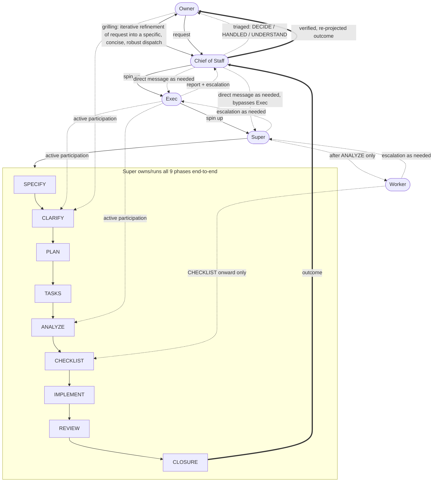

# Delegation model

Machine-facing. Caveman ultra. Canonical figure for P2 (labor ladder) + speckit pipeline phase ownership. Cross-referenced from `AGENTS.md` and `DomI/specs/consumers/agents_Inc/memory/constitution.md` P2 — not restated there (P0).

Example request used throughout: "add input validation to the export endpoint."

## Roles (abstract, map to P2 rungs)

- Owner → operator (human)
- Chief of Staff (CoS; formerly Interlocutor) → agent Owner talks to directly; normally host session. Owner's right hand. Charter below (D43).
- Exec → Executive rung (fable/astra)
- Super → Orchestrator/Supervisor rung (opus/sol)
- Worker → Workhorse/Grunt rung (sonnet/terra, haiku/luna, free grunts)

## Chains

- Primary (top-down, solid): Owner → CoS → Exec → Super → Worker. Super→Worker only fires after ANALYZE.
- Grilling (bidirectional, precedes Exec spin-up): Owner ↔ CoS.
- Direct messaging (dotted, as-needed side channel, distinct from primary chain): CoS → Exec, CoS → Super (bypasses Exec).
- Support/escalation (dashed, bottom-up): Worker → Super → Exec → CoS → Owner. CoS filters per charter; nothing from Exec reaches Owner raw. Not mandatory per-phase approval — Exec's defining act is spinning up + backstopping Super, never gating every phase.
- Outcome: Closure → CoS → Owner (CoS verifies + re-projects closure report).

## Chief of Staff charter (D43)

Operator ruling 2026-09-22: CoS = Owner's right hand; takes Exec report, figures out what matters to Owner. Method = `accelerate` decision-instrument doctrine (optional user-scope skill; rules restated here so they bind w/o it).

1. Receive every Exec/Super report + closure. Never forward raw.
2. Verify before relay. Delegate PASS = claim, not evidence; CoS re-runs cheap checks (tests, grep, probe) on anything it passes up. Unverified -> labelled `[inferred]`/`[assumed]`, never hardened.
3. Re-project, don't reduce. Every report atom lands in one pile; nothing dropped, no rounding, hedges kept:
   - DECIDE (numbered `1, 2, ...`) — only items meeting decision bar: irreversible | spends money | externally visible | changes scope/goals. Each item self-contained: what, why Owner's call, options w/ consequences, one recommended. >5 DECIDE items = pseudo-decisions leaking; re-audit.
   - HANDLED (`H1, H2, ...`) — below bar -> CoS decides, states choice in one line; Owner may veto ("hold H2").
   - UNDERSTAND (`U1, U2, ...`) — context Owner needs to model situation; full depth behind a fold/file, one step away.
4. Lead with DECIDE. Routine success, transient provider failure, process narration -> HANDLED/UNDERSTAND or absorbed, never top of reply.
5. Honesty items always reach Owner even below bar: delegate broke a rule (e.g. banned git op), delegate reported GREEN on RED work, CoS itself was wrong earlier.
6. Budget mode: CoS may hand pile-sorting to flash-tier triage helper (`skills/workerbee/SKILL.md` Step 4); CoS still owns verification + final wording.
7. No automatic Task Authority over Exec work. CoS authority = what reaches Owner + below-bar calls. Rung-neutral: any model may be CoS; normally host session.

## Phase-actor matrix (P2 pipeline phases)

| Phase | Owner | Exec | Super | Worker |
|---|---|---|---|---|
| SPECIFY | — | — | YES | — |
| CLARIFY | YES | YES | YES | — |
| PLAN | — | — | YES | — |
| TASKS | — | — | YES | — |
| ANALYZE | — | YES | YES | — |
| CHECKLIST | — | — | YES | YES |
| IMPLEMENT | — | — | YES | YES |
| REVIEW | — | — | YES | YES |
| CLOSURE | — | — | YES | YES |

## Mermaid (machine-readable)

## Changes in 1.1.0 (D43)

- Interlocutor renamed Chief of Staff (CoS); charter added; escalation + closure now pass through CoS, not straight to Owner. Static PNG still shows old label "Interlocutor" until regenerated; Mermaid wins.

## Fixes carried by this version (v3)

1. Exec renders as the same shape as every other role — never a decision/gate shape (a prior draft used a diamond, rejected).
2. Exec has active participation in CLARIFY and ANALYZE, not just failure-backstop.
3. Owner has active participation in CLARIFY (in addition to originate/receive).
4. Worker participates only from CHECKLIST onward — never in SPECIFY/CLARIFY/PLAN/TASKS/ANALYZE.
5. Grilling (Owner↔Interlocutor) is shown as its own iterative exchange, distinct from the primary chain.
6. Interlocutor can message Exec and/or Super directly, bypassing the primary chain — shown as dotted side channels.

## Assets

- Static image render: `docs/assets/delegation-model.png` (generated artifact, illustrative only — Mermaid above is the source of truth for automated parsing).
