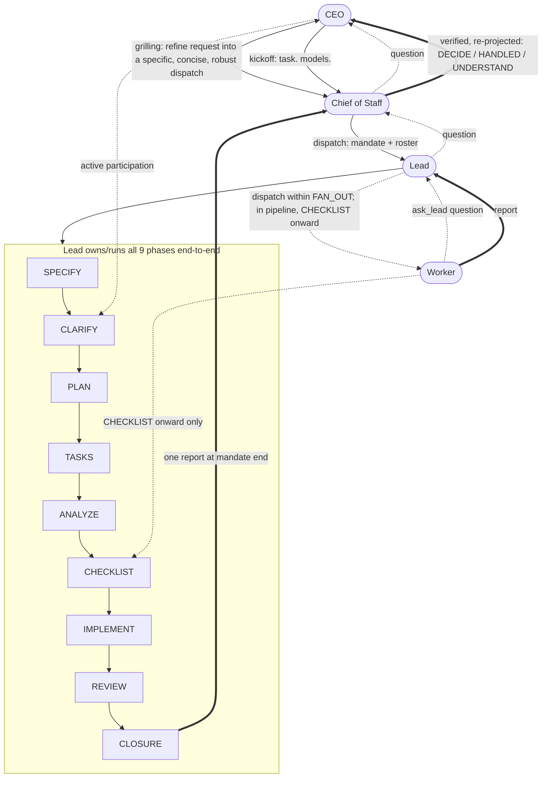

# Delegation model

Machine-facing. Caveman ultra. Canonical figure for P2 (labor ladder) + speckit pipeline phase ownership. Terms per `CONTEXT.md`; rulings D43 (CoS), D46 (Lead, chain), D48 (fan-out), D51 (broker), D54 (questions). Cross-referenced from `AGENTS.md` and `DomI/specs/consumers/agents_Inc/memory/constitution.md` P2 — not restated there (P0).

Example request used throughout: "add input validation to the export endpoint. opus, haiku."

## Roles

Fixed nouns (D46.4): CEO, CoS. Every other role = reporting chain, not title.

- CEO → operator (human). Alias Owner (pre-D46 text).
- Chief of Staff (CoS; formerly Interlocutor) → agent CEO talks to directly; normally host session. Charter below (D43).
- Lead → top-ranked model CEO named for the run; manages run, owns mandate. Aliases Supervisor, Orchestrator.
- Worker → any agent reporting to a Lead. Aliases Delegate, Team (collective), Workhorse, Grunt.
- Second → retired as a role noun (D46.4); an agent that helps a run gets no authority from being second, vendor, or rung.

Rungs (Executive, Orchestrator, Workhorse, Grunt) = cost class only, never a role. Ladder (`ROUTING-RANKING.md`) picks the Lead among named models: higher rung manages; same rung → CoS asks CEO one interactive question naming the Lead, recommended answer first. CoS states resolved chain in one line only when surprising, with a discrete justification (D46.2). Example: opus (Orchestrator) = Lead, haiku (Grunt) = Worker.

## Delegation by rung (D46.3, D48)

- Executive, Orchestrator → any lower rung.
- Workhorse → Grunt only, enumerated allowlist.
- Grunt → never delegates.
- Depth cap 3 below CoS. Per-mandate budget: `FAN_OUT: width <n>, total <n>, depth <n>`; rung defaults + ceilings in D48; Lead reports `WORKERS SPAWNED: n`.

## Chains (D46.11)

- Grilling (bidirectional, before dispatch): CEO ↔ CoS.
- Kickoff grammar (D46.9): `<task>. <models>.` Defaults: chain by ladder, effort medium, gates derived from task, home repo from consumer `AGENTS.md`. Each extra word (effort, budget mode, review vendor) overrides exactly one default.
- Dispatch (top-down): CEO → CoS → Lead → Worker. CoS dispatches only the Lead, with full mandate + remaining roster. Lead runs its Workers to completion. Nested Lead dispatch goes through the broker (D51).
- Report (bottom-up): Worker → Lead (a finished Worker may take resume turns and return more reports, D54). Lead → CoS exactly once, at mandate end. No progress updates flow up.
- Escalation (question path only): Worker asks Lead (`ask_lead`, D54) → Lead asks CoS → CoS asks CEO. Each level answers what it can.
- Outcome: Lead report → CoS verifies + re-projects (charter) → CEO.

## Hard separations (D46.10, gate-enforced)

1. Author never grades own work.
2. Reviewer = different vendor for canon edits + irreversible acts; same vendor allowed for routine code.
3. Only CoS commits and pushes.
4. Delegate sees only its slice: never run tree, sibling reports, CEO reasoning.

## Chief of Staff charter (D43, D46.5-6)

Operator ruling 2026-09-22: CoS = CEO's right hand; takes Lead report, figures out what matters to CEO. Method = `accelerate` decision-instrument doctrine (optional user-scope skill; rules restated here so they bind w/o it).

1. Receive every Lead report + closure. Never forward raw.
2. Verify before relay. Delegate PASS = claim, not evidence; CoS re-runs cheap checks (tests, grep, probe) on anything it passes up. Unverified -> labelled `[inferred]`/`[assumed]`, never hardened.
3. Re-project, don't reduce. Every report atom lands in one pile; nothing dropped, no rounding, hedges kept:
   - DECIDE (numbered `1, 2, ...`) — only items meeting decision bar: irreversible | spends money | externally visible | changes scope/goals. Each item self-contained: what, why CEO's call, options w/ consequences, one recommended. >5 DECIDE items = pseudo-decisions leaking; re-audit.
   - HANDLED (`H1, H2, ...`) — below bar -> CoS decides, states choice in one line; CEO may veto ("hold H2").
   - UNDERSTAND (`U1, U2, ...`) — context CEO needs to model situation; full depth behind a fold/file, one step away.
4. Lead with DECIDE. Routine success, transient provider failure, process narration -> HANDLED/UNDERSTAND or absorbed, never top of reply.
5. Honesty items always reach CEO even below bar: delegate broke a rule (e.g. banned git op), delegate reported GREEN on RED work, CoS itself was wrong earlier.
6. Budget mode: CoS may hand pile-sorting to flash-tier triage helper (`skills/workerbee/SKILL.md` Step 4); CoS still owns verification + final wording.
7. No automatic Task Authority over Lead work. CoS authority = what reaches CEO + below-bar calls. Rung-neutral: any model may be CoS; normally host session.
8. Hands (D46.5): CoS reads to route + verify; answers lookups of ≤3 tool calls itself; every repo edit goes through a delegate.
9. CEO report shape (D46.6): decisions first, with CoS pick; then one line per result, marked verified or not; then lessons needing sign-off. Transcripts + reports stay in files, named once.
10. Big lift (D46.7): run spawned ≥2 delegates, or edited canon (`AGENTS.md`, `CONTEXT.md`, `docs/DECISIONS.md`, any `SKILL.md`, policy) -> status card required.

## Run spec + home repo (D46.8)

- One short run spec per run: ask, resolved chain, gates, snapshot path, outcome. Lives in home repo `specs/consumers/<repo>/runs/`. This operator's home repo = DomI; other consumers name theirs in `AGENTS.md`.
- `agents-inc dispatch` resolves home repo: `--home-repo`, then `AGENTS_INC_HOME_REPO`, then first `agents-inc home repo: <path>` line in `<cwd>/AGENTS.md` (`~` allowed).
- Agent-only artifacts (specs, run specs, teach-me notes, introspect records, grill notes) live in home repo, never consumer repo.

## Phase-actor matrix (P2 pipeline phases)

Lead owns/runs all 9 phases. CoS role per phase = route + verify, not author. Worker phase limit (CHECKLIST onward) is the speckit pipeline's ownership rule (v1 fix 4), not a D46 dispatch limit; outside the pipeline a Lead dispatches by rung (D46.3).

| Phase | CEO | CoS | Lead | Worker |
|---|---|---|---|---|
| SPECIFY | — | — | YES | — |
| CLARIFY | YES | YES (relays questions) | YES | — |
| PLAN | — | — | YES | — |
| TASKS | — | — | YES | — |
| ANALYZE | — | YES (escalation only) | YES | — |
| CHECKLIST | — | — | YES | YES |
| IMPLEMENT | — | — | YES | YES |
| REVIEW | — | — | YES | YES (never own work) |
| CLOSURE | — | YES (verify, commit, push) | YES | YES |

## Mermaid (machine-readable)

```mermaid
flowchart TD
    CEO([CEO])
    CoS([Chief of Staff])
    Lead([Lead])
    Worker([Worker])

    CEO <-->|grilling: refine request into a specific, concise, robust dispatch| CoS
    CEO -->|kickoff: task. models.| CoS
    CoS -->|dispatch: mandate + roster| Lead
    Lead -.->|dispatch within FAN_OUT; in pipeline, CHECKLIST onward| Worker

    subgraph Pipeline["Lead owns/runs all 9 phases end-to-end"]
        direction LR
        SPECIFY --> CLARIFY --> PLAN --> TASKS --> ANALYZE --> CHECKLIST --> IMPLEMENT --> REVIEW --> CLOSURE
    end

    Lead --> Pipeline
    CEO -.->|active participation| CLARIFY
    Worker -.->|CHECKLIST onward only| CHECKLIST

    Worker -.->|ask_lead question| Lead
    Lead -.->|question| CoS
    CoS -.->|question| CEO
    Worker ==>|report| Lead

    CLOSURE ==>|one report at mandate end| CoS
    CoS ==>|verified, re-projected: DECIDE / HANDLED / UNDERSTAND| CEO
```

## Changes in 2.0.0 (D46)

- Exec and Super roles replaced by one Lead (D46.4); rungs are cost classes only.
- CoS dispatches only the Lead; CoS → Exec/Super direct side channels removed (D46.11).
- Escalation is a question path; reporting is once at mandate end, no progress updates (D46.11).
- Added: delegation by rung, fan-out (D48), hard separations (D46.10), CoS hands, report shape, big lift (D46.5-7), run spec + home repo (D46.8), kickoff defaults (D46.9). Second retired.
- Cross-vendor review: sol, run 20261010T205403Z-sol-46bfad, VERDICT CHANGES (8), all applied.
- Owner renamed CEO per D46.4. Static PNG still shows pre-D46 labels until regenerated; Mermaid wins.

## Changes in 1.1.0 (D43)

- Interlocutor renamed Chief of Staff (CoS); charter added; escalation + closure pass through CoS.

## Assets

- Static image render: `docs/assets/delegation-model.png` (generated artifact, illustrative only, pre-D46 labels — Mermaid above is the source of truth for automated parsing).
